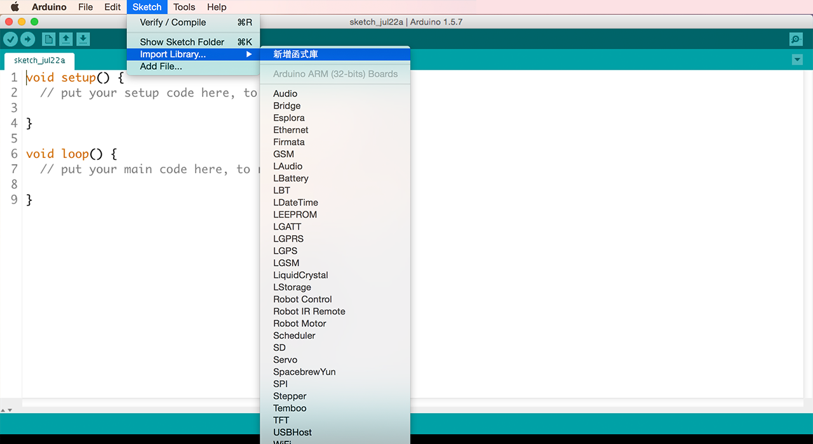
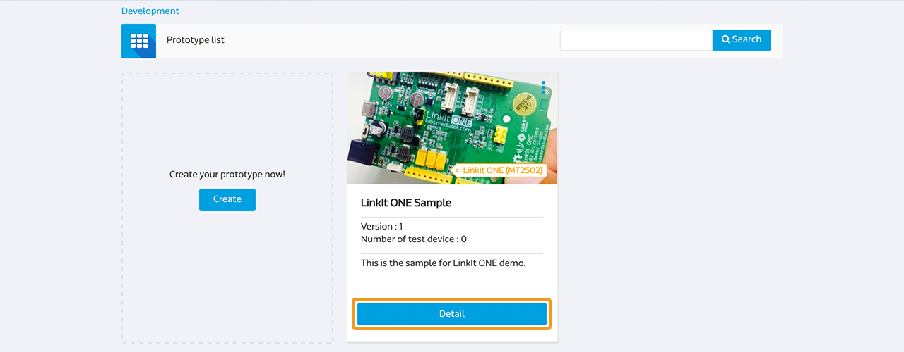
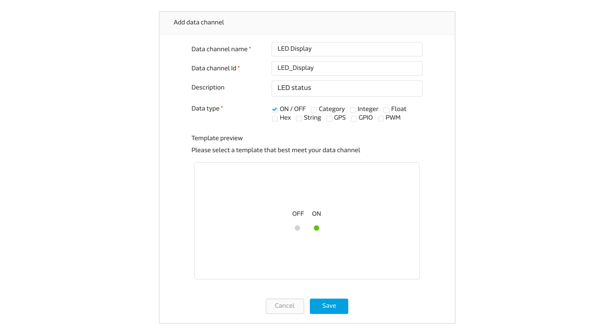
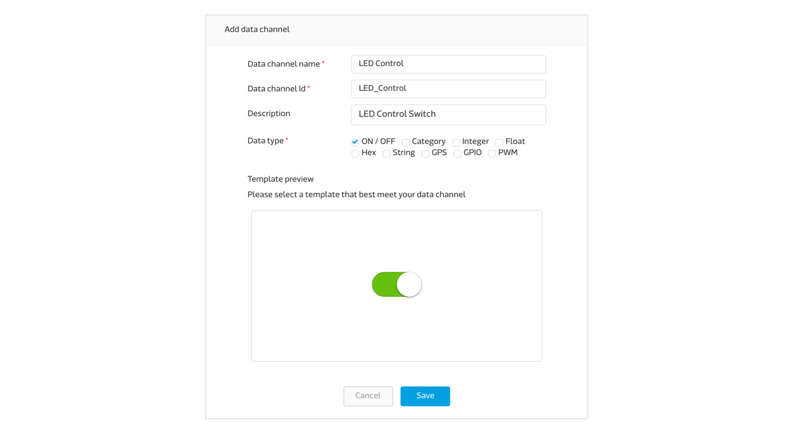
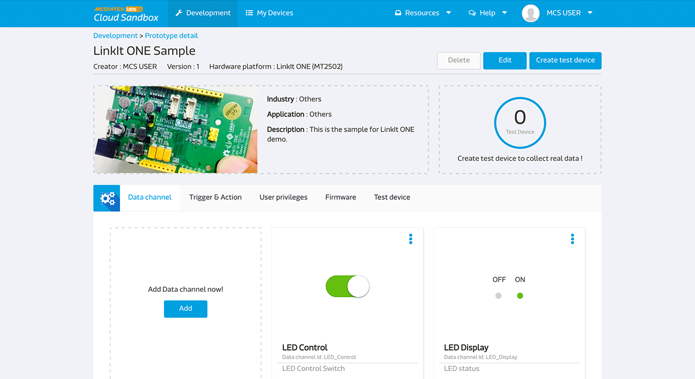
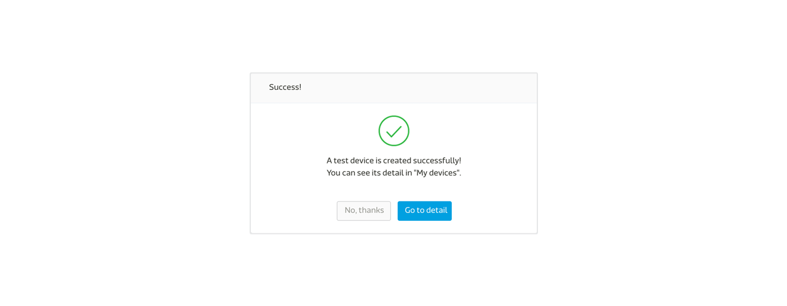
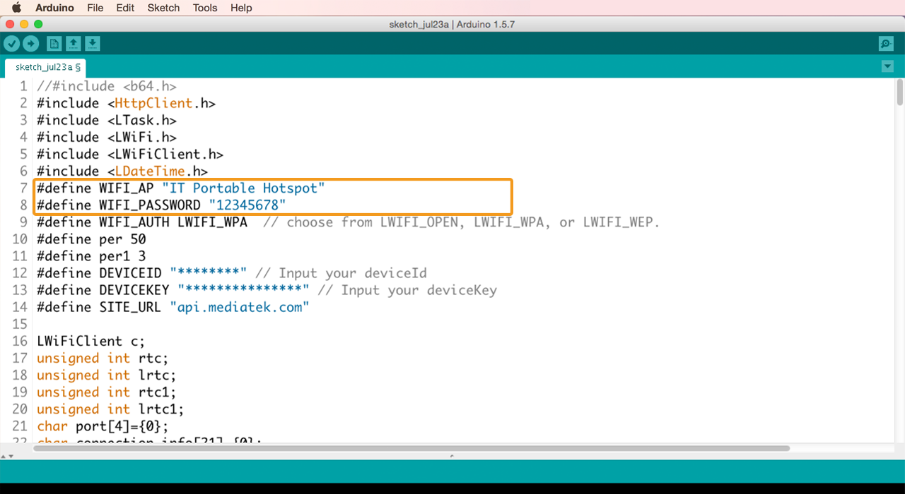
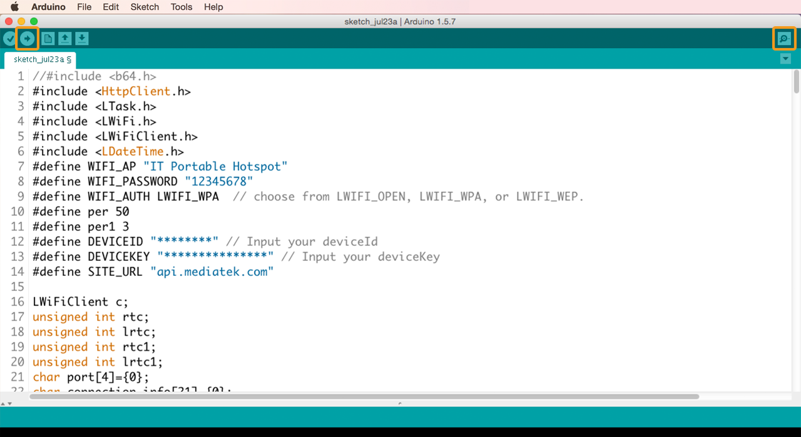
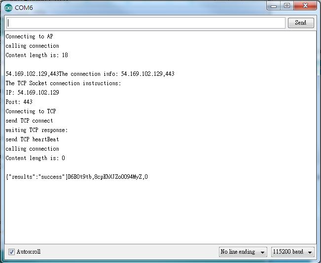
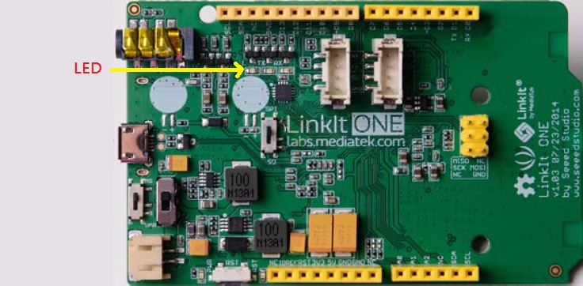

# LinkIt One Tutorial

## Computer and Board Setup

Before you dump some code onto your board and link it up to the cloud, you're going to want to make sure your computer and board are set up the right way. This can be done in three steps:

1. Download the Arduino IDE and LinkIt One SDK
[Mac] (http://labs.mediatek.com/site/global/developer_tools/mediatek_linkit/get-started/mac/install/)
[Windows] (http://labs.mediatek.com/site/global/developer_tools/mediatek_linkit/get-started/windows/install/)

2. Update the firmware on your board
[Mac] (http://labs.mediatek.com/site/global/developer_tools/mediatek_linkit/get-started/mac/update/)
[Windows] (http://labs.mediatek.com/site/global/developer_tools/mediatek_linkit/get-started/windows/update/)

3. Configure the SDK in the Arduino IDE, and connect your board to Wi-Fi via a port selection.
[Mac] (http://labs.mediatek.com/site/global/developer_tools/mediatek_linkit/get-started/mac/configure/)
[Windows] (http://labs.mediatek.com/site/global/developer_tools/mediatek_linkit/get-started/windows/configure/)

An excellent guide for this setup can be found at [here](http://labs.mediatek.com/site/global/developer_tools/mediatek_linkit/get-started/index.gsp).Please come back to this guide after finishing all the steps above, which can be done by visiting all the links in order.

**Just a note: The current LinkIt One SDK is only compatible with Arduino IDE versions 1.5.6-r2 BETA or 1.5.7 BETA.**

## Add Libraries

Now that your computer and your IDEs are all set up, it's time to integrate some libraries! For this example, the only library we need is the HttpClient library, which can be found [here](https://github.com/amcewen/HttpClient/releases). Download the .zip file, then open up your Arduino IDE.

In the "Sketch" drop-down, click on "Import Libraries", then navigate to your .zip file.

## Cloud Setup

Almost there! At this point, you're going to want to set up the MCS cloud so you can control and track your board. We've made it really easy; no downloading or coding required!

### Introduction

In this cloud setup, we're going to create a virtual test device on MCS that represents your LinkIt One board. We'll use this test device to upload Arduino code that pushes data points containing the state of the D13 LED on your board. The test device achieves this via the use of RESTful APIs, and furthermore, MCS is able to remotely control the state of the LED by using a TCP Socket.

A flow chart diagram is provided below for further illustration:

### Setup requirements

Before we begin, please make sure you have:

1. Battery Pack to power the development board (the board can also be powered if you plug the board into your laptop/desktop with a Micro-USB cord.
2. A live Wi-Fi network that is visible to your board.

There are no additional electrical components required.

### Step 1. Creating your Prototype

After **logging into your MCS account**, select **Development** on the navigation bar and click Create to **create** a new prototype.

Plop in whatever **name**, **prototype version**, **description**, and industry you'd like. However, make sure to select the **LinkIt ONE (MT2502)** option underneath the **Hardware Platform** dropdown list. Click **Save**.

Click on **Detail**.

Select the **Data channel** tab and click on **Add** to create a new data channel.

In this tutorial, we're going to create two data channels. One is a display-type data channel that will reflect the status of the LED light, and the other is a controller-type data channel that we'll use to issue commands to the board to switch the LED on and off.

Select **Add** on the Display data channel card, and **key in** the following information.

**Remember the data channel id**; we'll use this later in the tutorial to connect the data channel to the API.

Now, select **Add** on the controller data channel card, and **key in** the following information:

Again, **please take note** of the **data channel id**.

If done correctly, you should be able to view the two data channels you just created in your prototype details page.

### Step 2. Create Your Test Device

Click **Create Test Device** on the right upper corner of the page.

**Fill out** whatever device name and description you'd like. In this tutorial, we've used "LED Control" as the device name, but you can use whatever you want.

Click **Go to detail** to open your test device details page:

Please take note of the **deviceId** and **deviceKey**. We'll use this in the tutorial later.

### Step 3. Obtain Device ID, Device Key, Data Channel ID

Here's a quick summary of all the key pieces of information we've obtained so far from this tutorial:

| Name | Value | Remark |
| -- | -- | -- |
| deviceId | Dsre1qRQ | Unique Identifier for this Test Device |
| deviceKey | DFbtsNWg4AuLZ30v  | Unique API Key for this Test Device |
| dataChannelId | LED | Data Channel Id for LED status |
| dataChannelId | LED_CONTROL | Data Channel Id for LED control |

**Just a note: the deviceId and deviceKey shown here will be different from yours. Make sure to use your obtained values instead!**

## Add Source Code

You're finally all set to splash some code onto your board. Open a new sketch in your Arduino IDE and paste the following code into it: [here](https://raw.githubusercontent.com/Mediatek-Cloud/MCS/master/source_code/linkit_sample_ino.ino)

Now, you're going to want to customize this code to your unique board and cloud. Take your deviceID and deviceKey you grabbed from the previous step, and plop them in the correct places.

Next, configure the Wi-fi name and password so your board has access to whatever Wi-Fi it's connecting to.

**Just a note: your own Wi-Fi name and password are almost certainly going to be different than the ones shown here. Also, you shouldn't need to touch anything else other than the highlighted portions shown!**

The code that we just put in simply allows MCS to control an LED light on your board (specifially, LED light D13). For those of you interested in dissecting the code to see exactly how the code works, the following is a simple logic flow diagram outlining the steps we took. But, if you're not interested, it's totally okay to skip this part:

1. Calls RESTful API: GET from [here](api.mediatek.com/mcs/v2/devices/{deviceId}/connections.csv). We do this to grab the response values for both the Socket Server IP and the port
2. Initiate a TCP connection to the socket server.
3. Uploads the D13 (LED) status to MCS by using the RESTful API once every 5 seconds. We manage this by POSTing [here](api.mediatek.com/mcs/v2/devices/{deviceId}/datapoints.csv).
4. Listens for any switch commands issued by MCS via the TCP connection.
5. Refresh the heartbeat for the TCP connection every 90 seconds.

### Run it and go!

You're all done; time to see it in action! Make sure nothing's wrong with your Wi-Fi and that your board can see it, and upload your code to your board. Check your Serial Output to confirm that it's live and connected.

Now, all you need to do is to go back to your devices page. Click on the LED controller! When it flips to the ON state, the LED light on your board should turn on.

If you click the controller again and flip the switch back to the OFF state, the LED light on your board should turn off. Isn't that cool?

